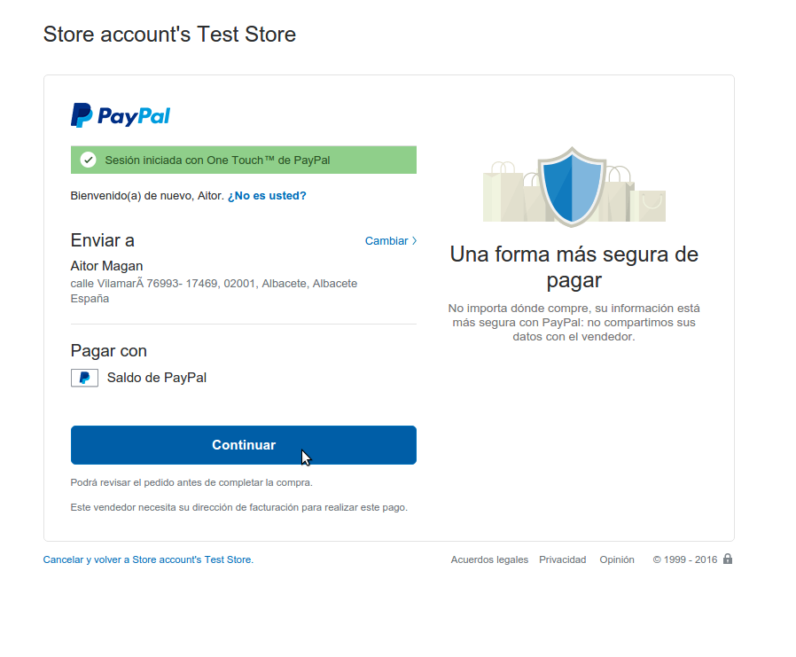

# Business API ecosystem

.fx: cover

@conwet

---
#Create Order

Customers can create orders for acquiring offerings. The different offerings to be included in an order are managed using the *Shopping Cart*.

To include an offering in the shopping cart there are two possibilities. You can
click on the *Add to Cart* button located in the offering panel when searching, or you can click on the *Add to Cart* button located in the offering details view.

---
# Create order

---
# Create order

---
# Create Order

If the offering has configurable characteristics or multiple price plans, a modal will be displayed where you can select your preferred options

---
# Create order

---
# Create order

---
# Create Order

Once you have selected your preferences for the offering click on *Add to Cart*

---
# Create order

---
# Create Order

Once you have included all the offerings you want to acquire to the shopping cart, you can create the order clicking on *Shopping Cart*, and then on *Checkout*

---
# Create order

---
# Create Order

In the displayed form, you can include an optional name, an optional description, or an optional note. Notes can include any additional information you want to provide to the sellers of the acquired offerings.

Then, you have to choose a priority for your order, and select one of your shipping addresses.

Once you have provided all the required information you can start the order creation clicking on *Checkout*

---
# Create order

---
# Create Order

In the next step, you will be redirected to *PayPal* so you can pay for the offerings according to their pricing models

---
# Create order

---
# Create Order

Finally, you will see a confirmation page

---
# Create order

---

.fx: back-cover

Thanks!

FIWARE                                FIWARE Lab
OPEN APIs FOR OPEN MINDS              Spark your imagination

         www.fiware.org               FIWARE Ops
twitter: @Fiware                      Easing your operations
