# Introduction to Business API ecosystem

.fx: cover

@conwet

---
# Sanity check Procedures

The Sanity Check Procedures are the steps that a System Administrator
will take to verify that an installation is ready to be tested. This is
therefore a preliminary set of tests to ensure that obvious or basic
malfunctioning is fixed before proceeding to unit tests, integration
tests and user validation.

---
## End to End Testing

Please note that the following information is required before starting
with the process:  The host and port where the Proxy is running  A
valid IdM user with the *Seller* role

To Check if the Business API Ecosystem is running, follow the next
steps:

* Open a browser and enter to the Business API Ecosystem

---
## End to End Testing

* Click on the *Sign In* Button

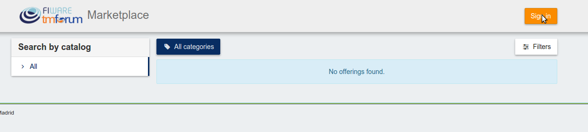

---
## End to End Testing

* Provide your credentials in the IdM page

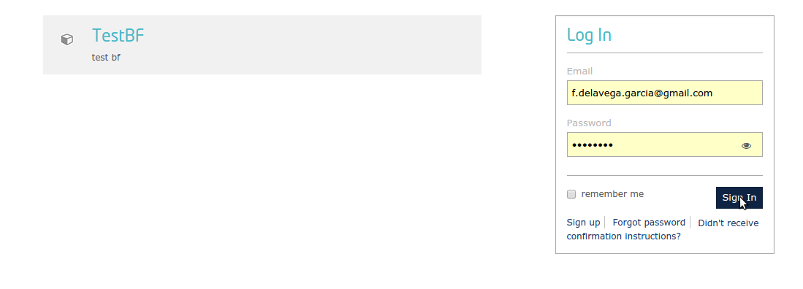

---
## End to End Testing

* Go to the *Revenue Sharing* section

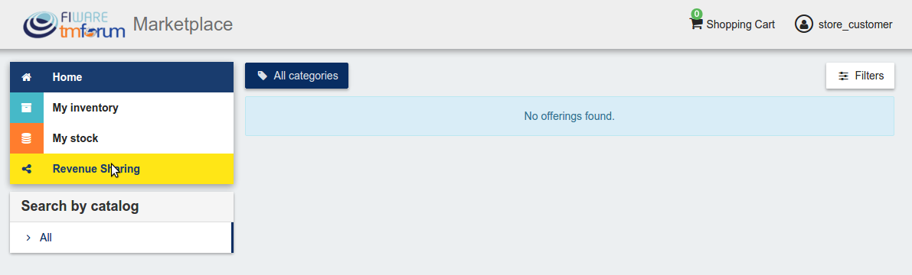

---
## End to End Testing

* Ensure that the default RS Model has been created

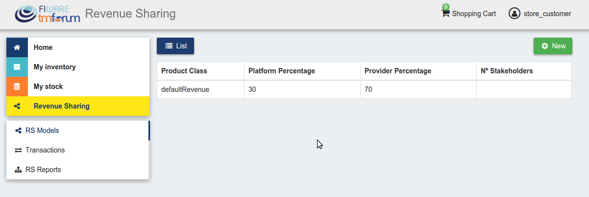

---
## End to End Testing

* Go to *My Stock* section

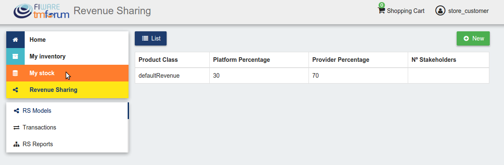

---
## End to End Testing

* Click on *New* for creating a new catalog

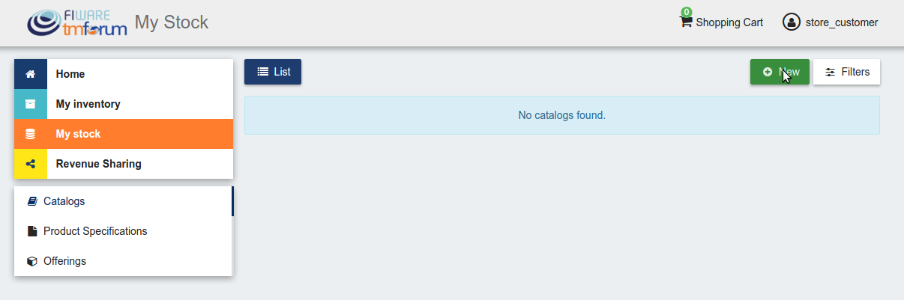

---
## End to End Testing

* Provide a name and a description and click on *Next*. Then click on
    *Create*

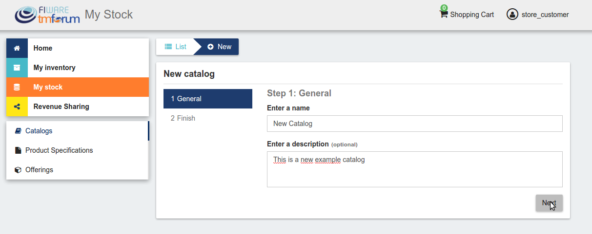

---
## End to End Testing

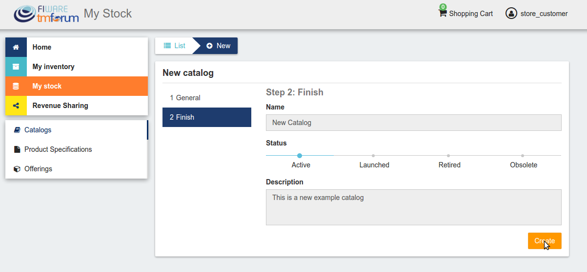

---
## End to End Testing

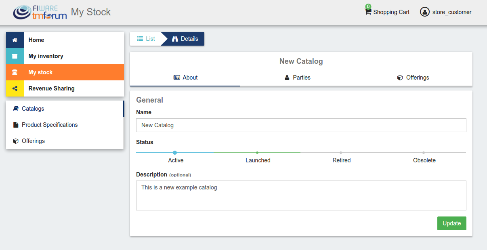

---
## End to End Testing

* Click on *Launched*, and then click on *Update*

---
## End to End Testing

---
## End to End Testing

* Go to *Home*, and ensure the new catalog appears

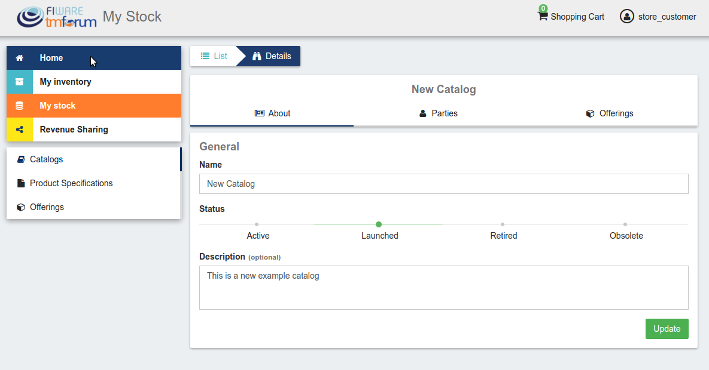

---
## End to End Testing

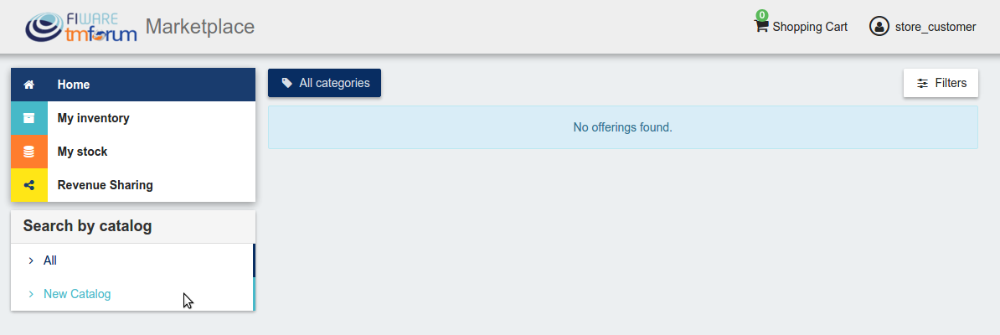

---
## List of Running Processes

We need to check that Java for the Glassfish server (APIs and RSS),
python (Charging Backend) and Node (Proxy) are running, as well as
MongoDB and MySQL databases. If we execute the following command:

	!bash
    ps -ewF | grep 'java\|mongodb\|mysql\|python\|node' | grep -v grep

---
## List of Running Processes

It should show something similar to the following:

    mongodb   1014     1  0 3458593 49996 0 sep08 ?        00:22:30 /usr/bin/mongod --config /etc/mongodb.conf
    mysql     1055     1  0 598728 64884  2 sep08 ?        00:02:21 /usr/sbin/mysqld
    francis+ 15932 27745  0 65187 39668   0 14:53 pts/24   00:00:08 python ./manage.py runserver 0.0.0.0:8006
    francis+ 15939 15932  1 83472 38968   0 14:53 pts/24   00:00:21 /home/user/business-ecosystem-charging-backend/src/virtenv/bin/python ./manage.py runserver 0.0.0.0:8006
    francis+ 16036 15949  0 330473 163556 0 14:54 pts/25   00:00:08 node server.js
    root      1572     1  0 1142607 1314076 3 sep08 ?      00:37:40 /usr/lib/jvm/java-8-oracle/bin/java -cp /opt/biz-ecosystem/glassfish ...

---
# Network interfaces Up & Open

To check the ports in use and listening, execute the command: :

   !bash
   $ sudo netstat -nltp

---
# Network interfaces Up & Open

The expected results must be something similar to the following: :

    Active Internet connections (only servers)
    Proto Recv-Q Send-Q Local Address           Foreign Address         State       PID/Program name
    tcp        0      0 127.0.0.1:8006          0.0.0.0:*               LISTEN      15939/python
    tcp        0      0 127.0.0.1:27017         0.0.0.0:*               LISTEN      1014/mongod
    tcp        0      0 127.0.0.1:28017         0.0.0.0:*               LISTEN      1014/mongod
    tcp        0      0 127.0.0.1:3306          0.0.0.0:*               LISTEN      1055/mysqld
    tcp6       0      0 :::80                   :::*                    LISTEN      16036/node
    tcp6       0      0 :::8686                 :::*                    LISTEN      1572/java
    tcp6       0      0 :::4848                 :::*                    LISTEN      1572/java
    tcp6       0      0 :::8080                 :::*                    LISTEN      1572/java
    tcp6       0      0 :::8181                 :::*                    LISTEN      1572/java

---
# Databases

The last step in the sanity check, once we have identified the processes
and ports, is to check that MySQL and MongoDB databases are up and
accepting queries. We can check that MySQL is working, with the
following command:

	!bash
	$ mysql -u <user> -p<password>

---
# Databases

You should see something similar to:

    Welcome to the MySQL monitor.  Commands end with ; or \g.
    Your MySQL connection id is 174
    Server version: 5.5.47-0ubuntu0.14.04.1 (Ubuntu)
    
    Copyright (c) 2000, 2015, Oracle and/or its affiliates. All rights reserved.
    
    Oracle is a registered trademark of Oracle Corporation and/or its
    affiliates. Other names may be trademarks of their respective
    owners.
    
    Type 'help;' or '\h' for help. Type '\c' to clear the current input statement.
    
    mysql>

---
# Databases

For MongoDB, execute the following command: :

    !bash
    $ mongo <database> -u <user> -p <password>

You should see something similar to: :

    MongoDB shell version: 2.4.9
    connecting to: <database>
    >

---

.fx: back-cover

Thanks!

FIWARE                                FIWARE Lab
OPEN APIs FOR OPEN MINDS              Spark your imagination

         www.fiware.org               FIWARE Ops
twitter: @Fiware                      Easing your operations
