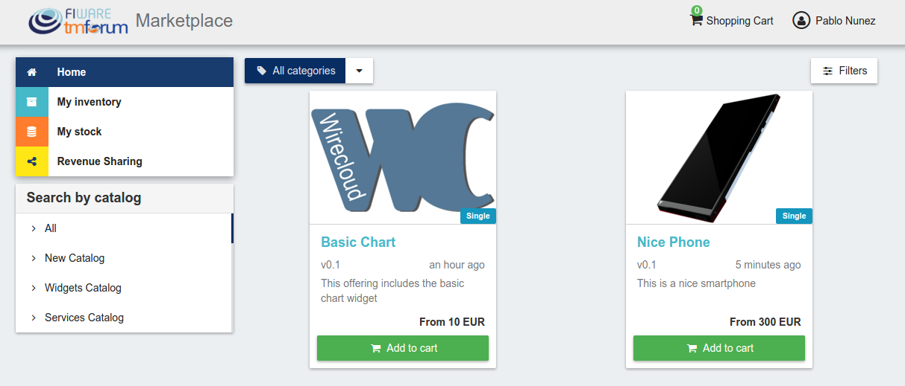
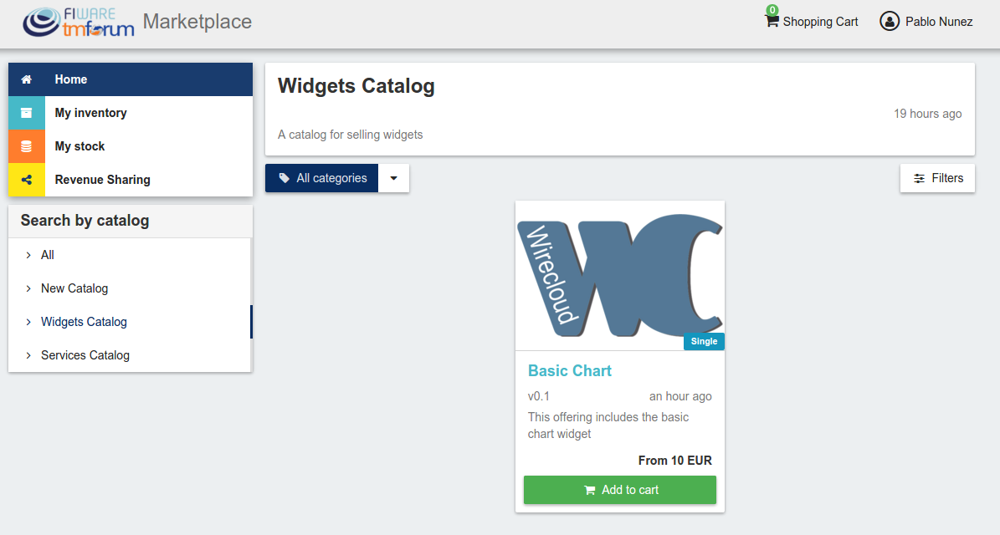
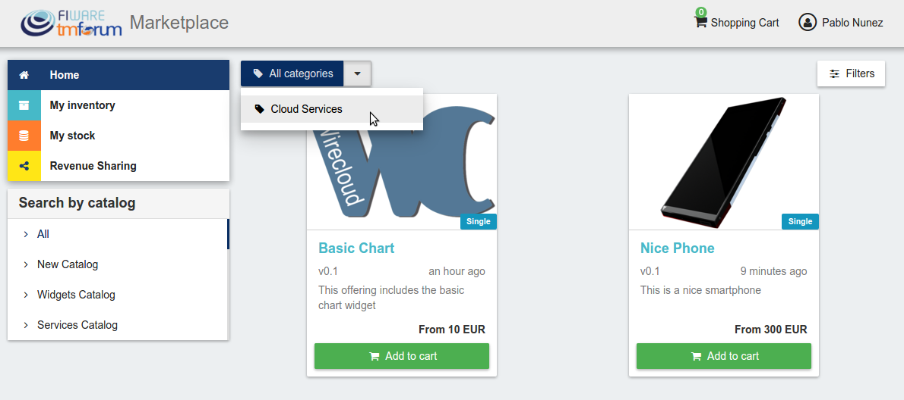
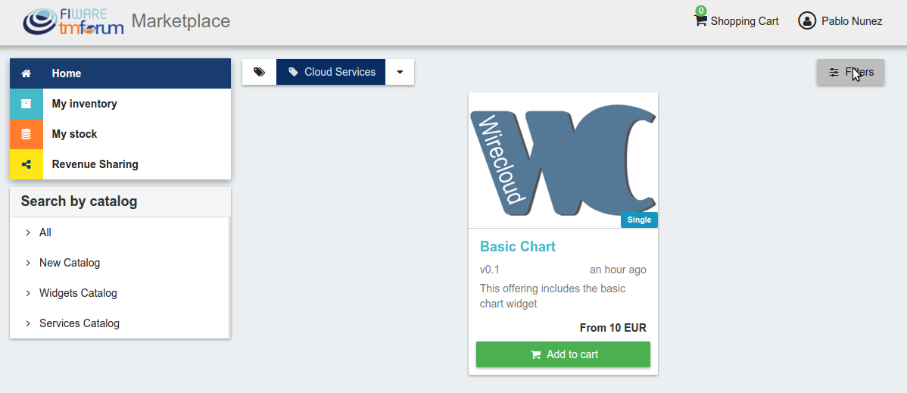
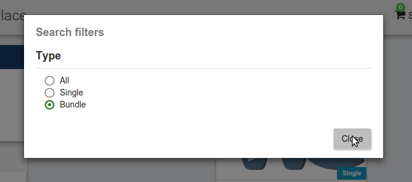
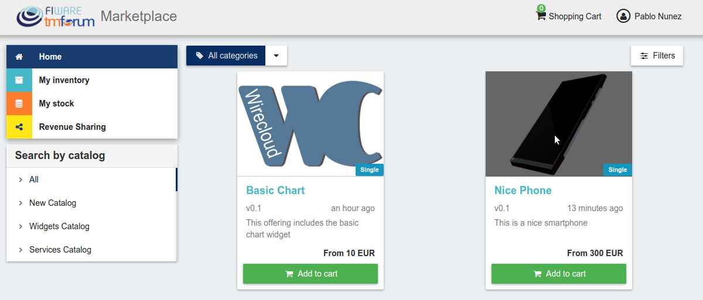
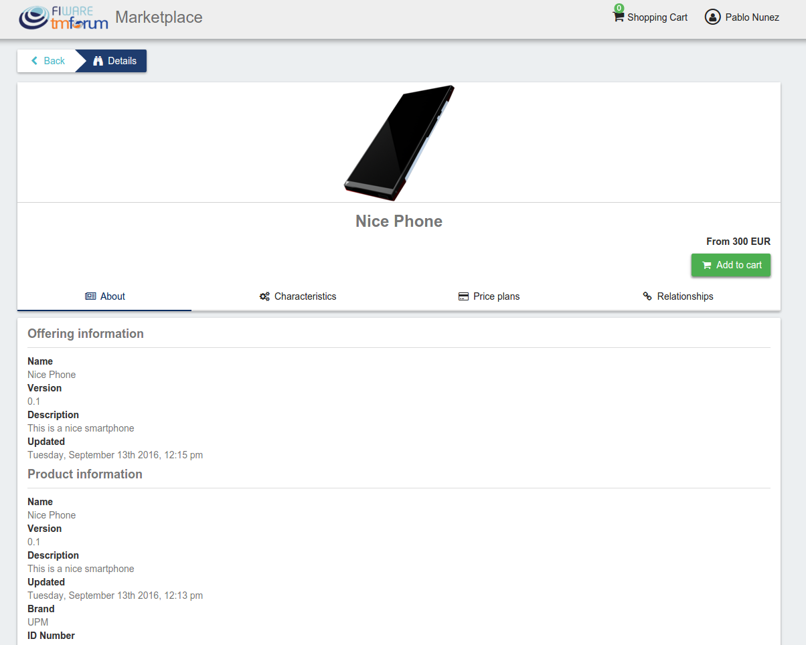
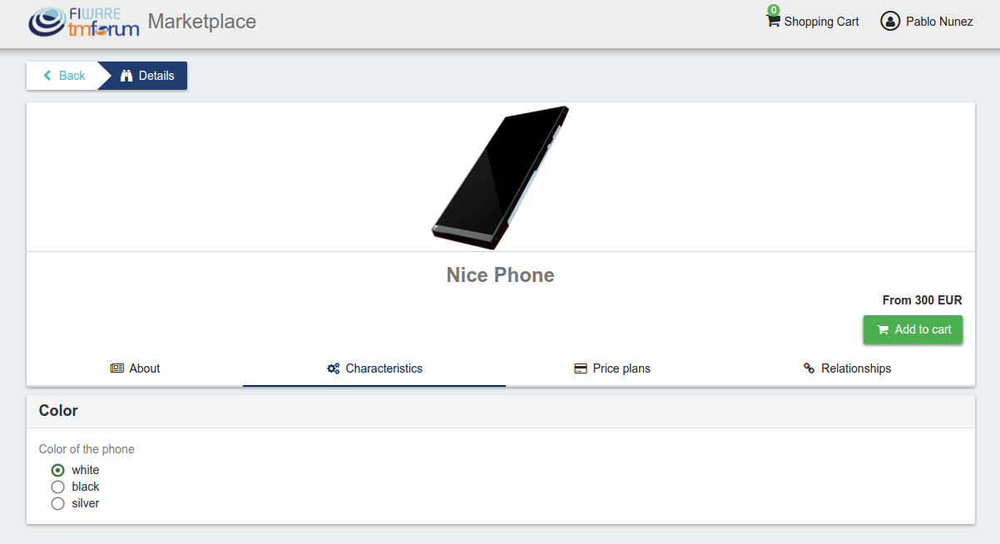
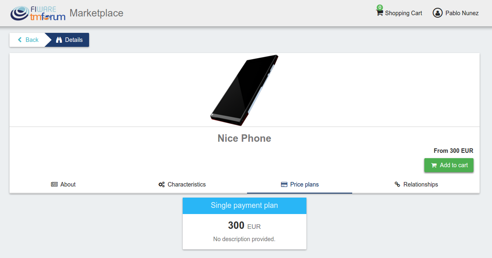

# Introduction to WireCloud

.fx: cover

@conwet

---
#List Available Offerings

All the available (*Launched*) offerings appear in the *Home* page of the Business API Ecosystem, so they can be seen by customers.

---
# List Available Offerings

---
# List Available Offerings

Additionally, customers can select an specific catalog of offerings by clicking on it.

---
# List Available Offerings

---
# List Available Offerings

---
# List Available Offerings

Moreover, customers can filter the shown offerings by category using the categories dropdown and choosing the wanted one.

---
# List Available Offerings

---
# List Available Offerings

Finally, customers can also filter bundle or single offerings using the *Filters* modal.

---
# List Available Offerings

---
# List Available Offerings

---
# List Available Offerings

Customers can open the details of an offering by clicking on it

---
# List Available Offerings

---
# List Available Offerings

In the displayed view, it is shown the general info about the offering and its included product, the characteristics of the product, the price plans of the offering, and the existing relationships.

---
# List Available Offerings

---
# List Available Offerings

---
# List Available Offerings

