# Introduction to WireCloud

.fx: cover

@conwet

---
#Manage Acquired Products

The products you have acquired are located in *My Inventory*, there you can list
them, check their status, or download different assets.

---
# Manage Acquired Products

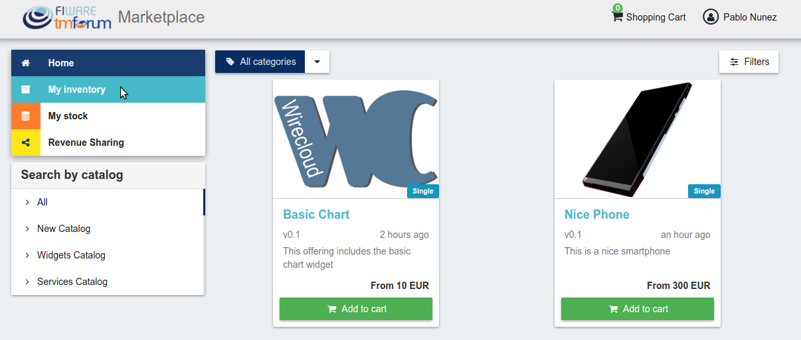

---
# Manage Acquired Products

In this view, it is possible to filter you products by its status. To do that click on *Filters*, select the related statuses, and click on *Close*

---
# Manage Acquired Products

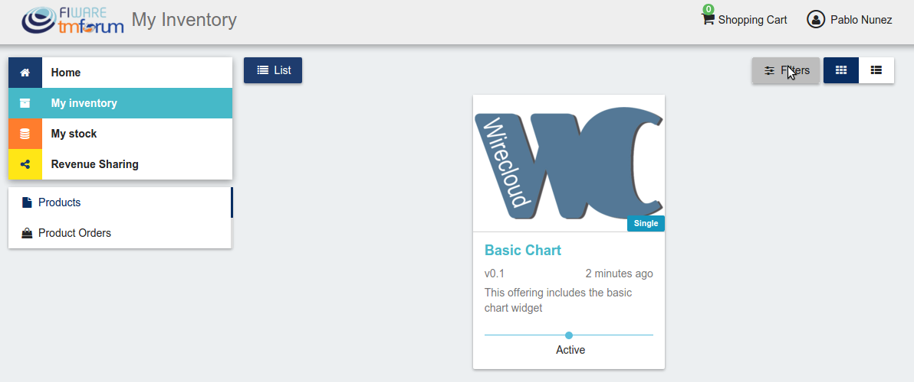

---
# Manage Acquired Products

---
# Manage Acquired Products

It is also possible to switch between the grid and tabular views using the related buttons

---
# Manage Acquired Products

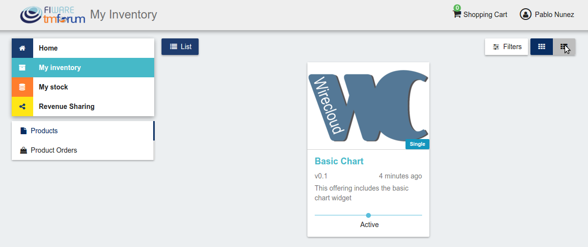

---
# Manage Acquired Products

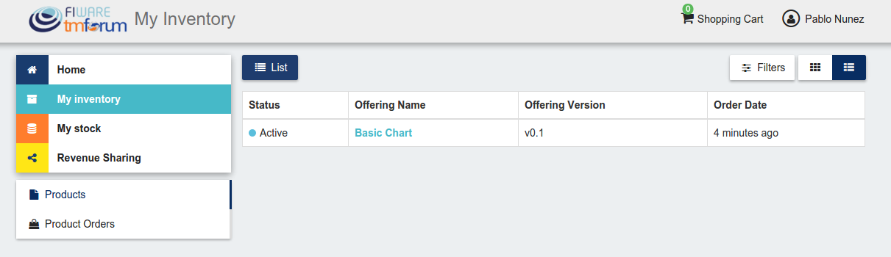

---
# Manage Acquired Products

You can manage a specific acquired product clicking on it

---
# Manage Acquired Products
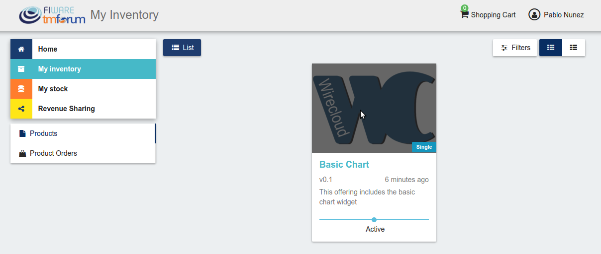

---
# Manage Acquired Products

In the displayed view, you can see the general info of the acquired product, and the characteristics and pricing you have selected.

---
# Manage Acquired Products

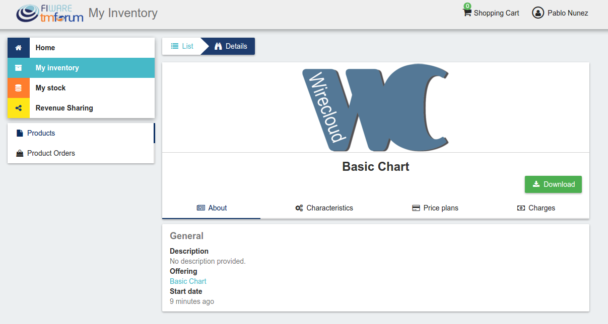

---
# Manage Acquired Products

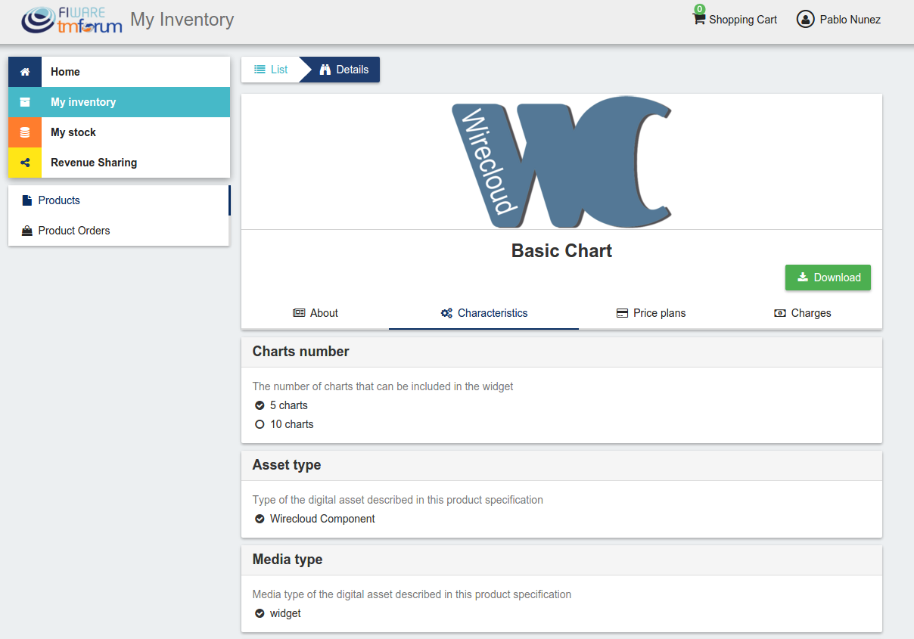

---
# Manage Acquired Products

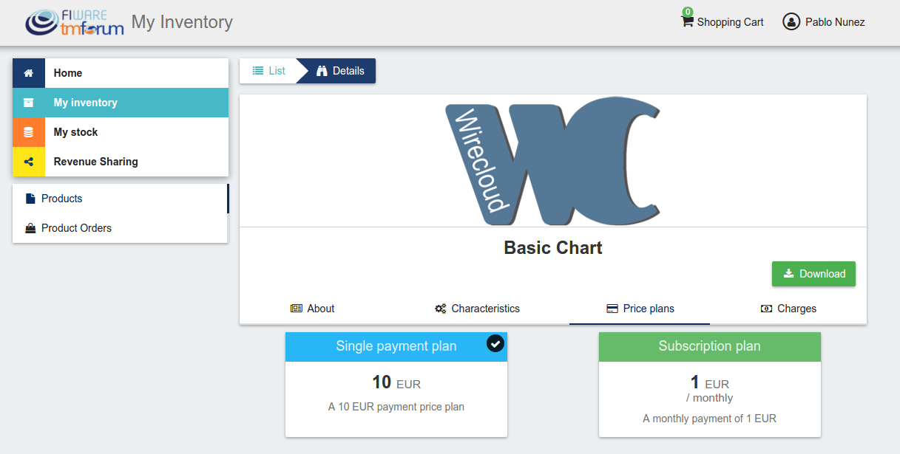

---
# Manage Acquired Products

Additionally, you can see your charges related to the product accessing to the *Charges* tab

---
# Manage Acquired Products

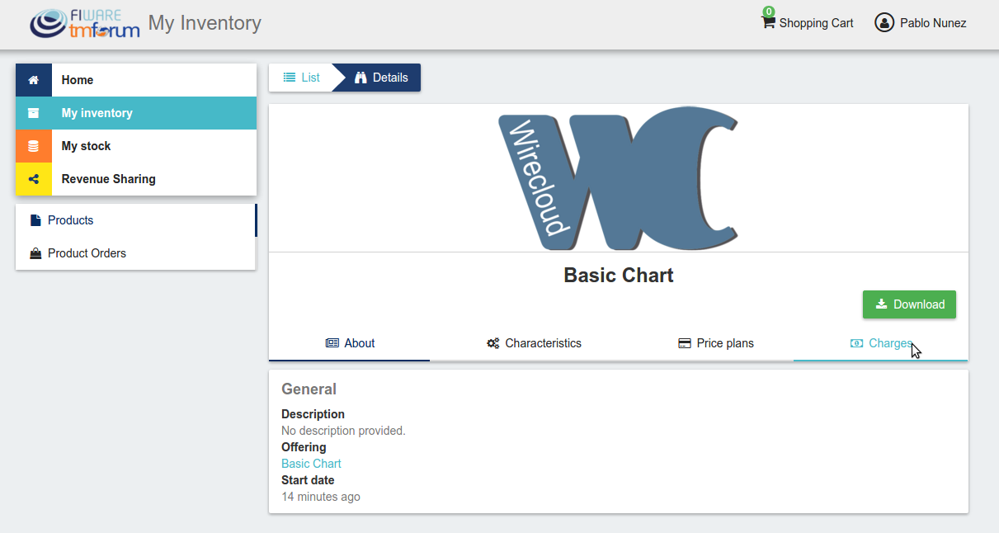

---
# Manage Acquired Products

In this tab, you will find detailed information of the different charges and you
will be able to download the related invoice clicking on *Download Invoice*

---
# Manage Acquired Products
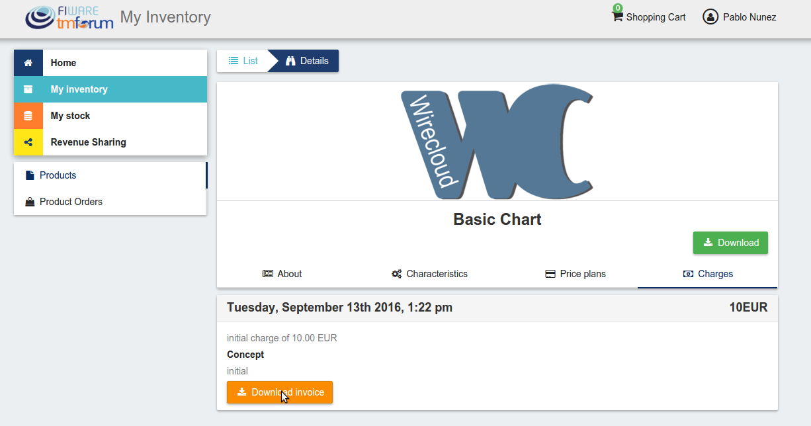

---
# Manage Acquired Products

Moreover, this product view allows to download the related assets when the product is digital. To do that click on *Download*

---
# Manage Acquired Products

---
# Manage Acquired Products

In case the chosen pricing model defines a recurring payment or a usage payment,
you will be able to renew your product clicking on *Renew*. After clicking, you will be redirected to PayPal to pay the related amount.

---
# Manage Acquired Products

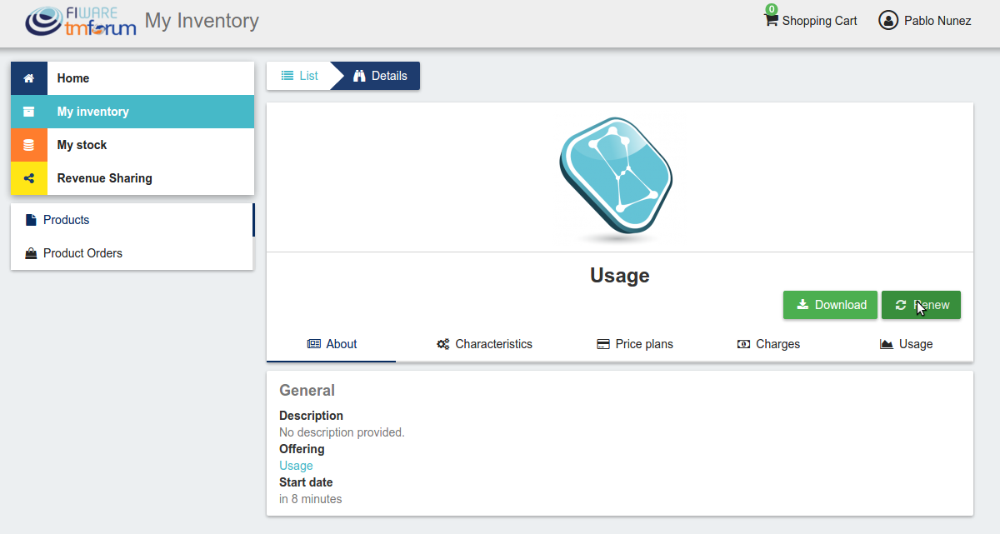

Note: If you product has expired and you do not renew it, it will be suspended, which means you will not have access to the acquired service until you pay

---
# Manage Acquired Products

If the acquired product has a usage based price plan, you will be able to see your current consumption accessing the *Usage* tab

---
# Manage Acquired Products
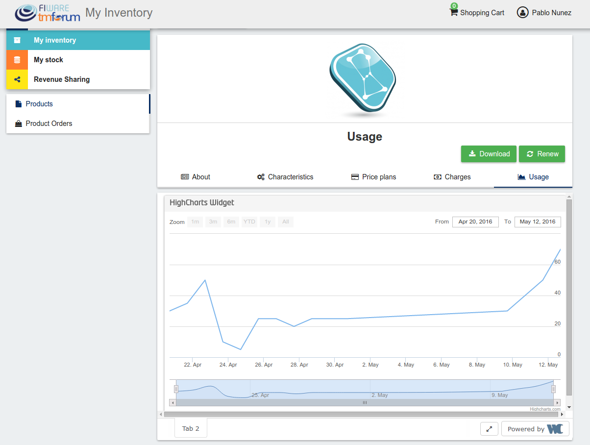

