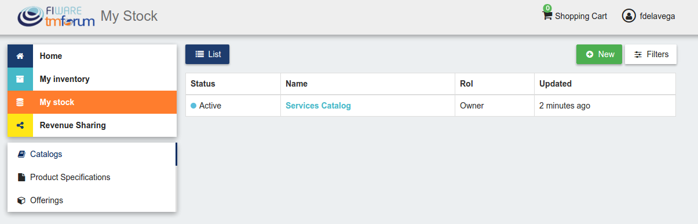
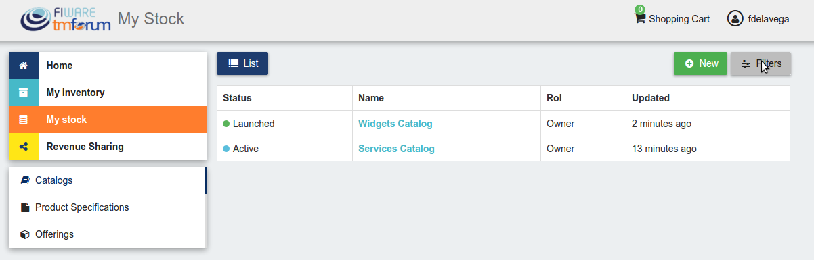
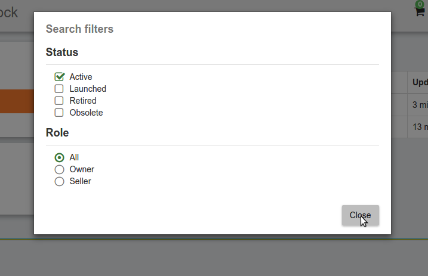
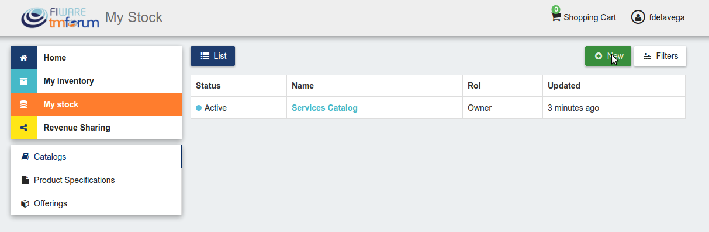
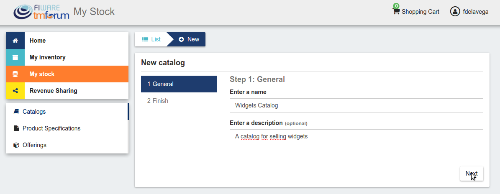
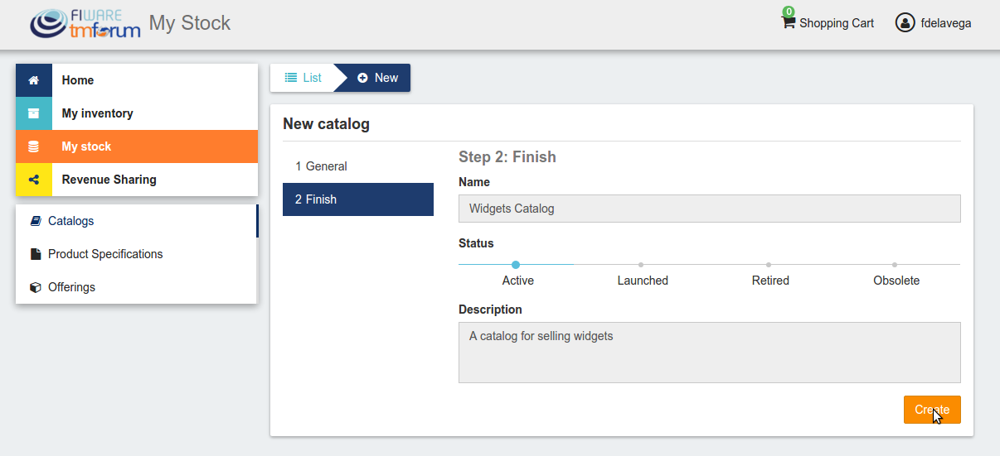
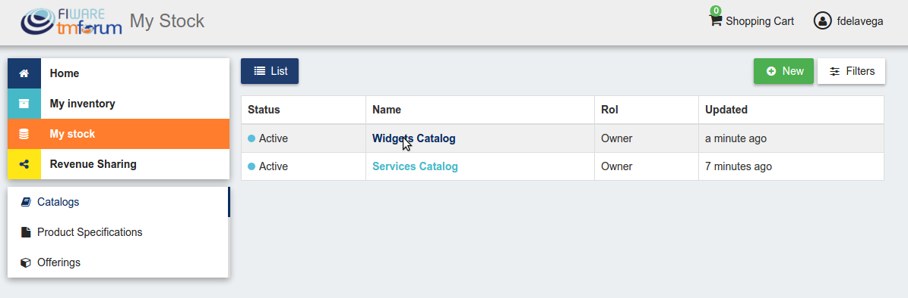
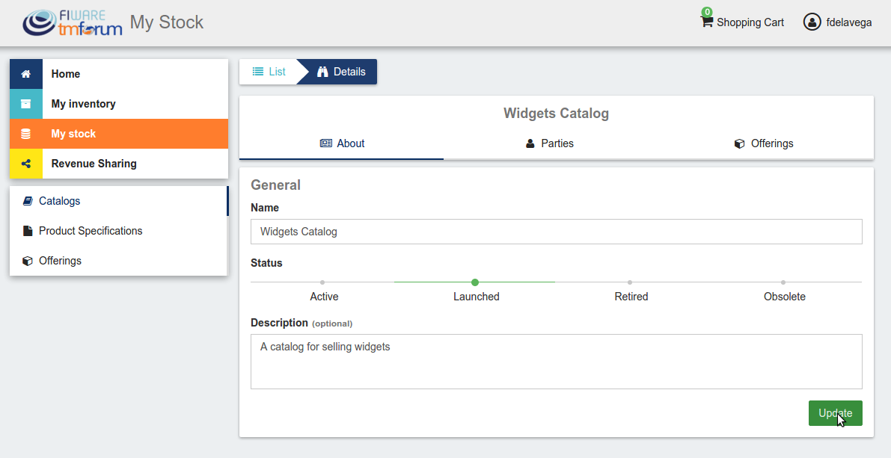

# Introduction to WireCloud

.fx: cover

@conwet

---
#Manage Catalogs

The *Catalogs* section is the one that is open by default when the seller accesses *My Stock* section. This section contains the catalogs the seller has created.

---
# Manage Catalogs

---
# Manage Catalogs

Additionally, it is possible to filter the shown catalogs by status and the role
you are playing by clicking on *Filters*, choosing the required ones, and clicking on *Close*

---
# Manage Catalogs

---
# Manage Catalogs

---
# Manage Catalogs

To create a new catalog click on the *New* button.

---
# Manage Catalogs

---
# Manage Catalogs

Then, provide a name and an optional description for the catalog. Once you have filled the fields, click on *Next*, and then on *Create*

---
# Manage Catalogs

---
# Manage Catalogs

---
# Manage Catalogs

Sellers, can also update their catalogs. To do that, click on the name of the catalog to open the update view.

---
# Manage Catalogs

---
# Manage Catalogs

Then update the fields you want to modify and click on *Update*. In this view, it is possible to change the *Status* of the catalog. To start monetizing the catalog, and make it appear in the *Home* you have to change its status to *Launched*

---
# Manage Catalogs

---

.fx: back-cover

Thanks!

FIWARE                                FIWARE Lab
OPEN APIs FOR OPEN MINDS              Spark your imagination

         www.fiware.org               FIWARE Ops
twitter: @Fiware                      Easing your operations
