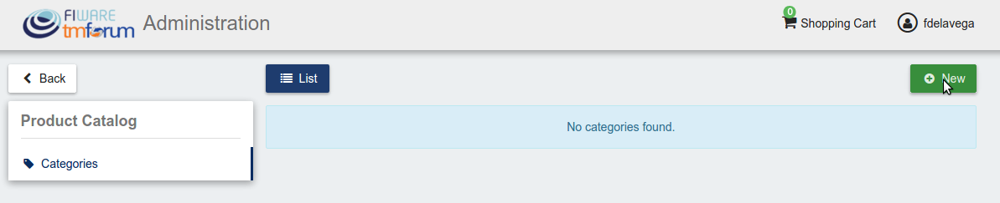
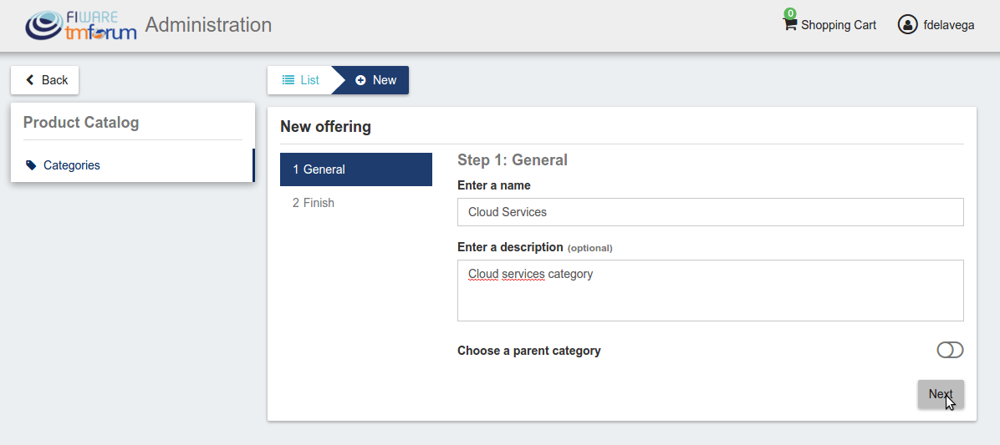
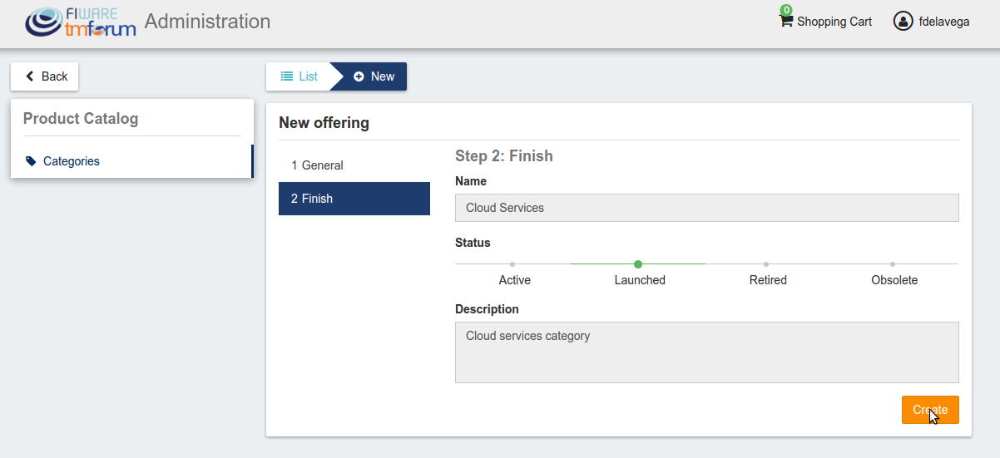
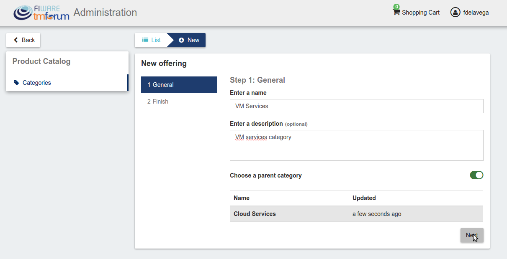
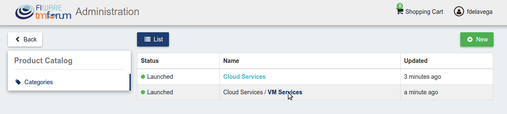
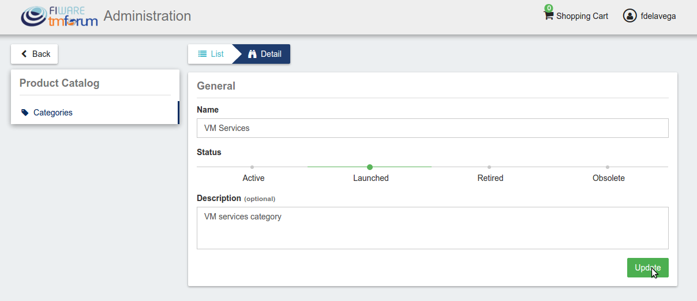

# Introduction to WireCloud

.fx: cover

@conwet

---
# Manage Categories

Admin users are authorized to create the system categories that can be used by *Sellers* to categorize their catalogs, products, and offerings.

To create categories, go to the *Administration* section, and click on *New*

---
# Manage Categories

---
# Manage Categories

Then, provide a name and an optional description for the category. Once the information has been included, click on *Next*, and then on *Create*

---
# Manage Categories

---
# Manage Categories

---
# Manage Categories

Categories in the Business API Ecosystem can be nested, so you can choose a parent category if you want, while creating.

---
# Manage Categories

---
# Manage Categories

Existing categories can be updated. To edit a category click on the category name.

---
# Manage Categories

---
# Manage Categories

Then edit the corresponding fields and click on *Update*.

---
# Manage Categories

---

.fx: back-cover

Thanks!

FIWARE                                FIWARE Lab
OPEN APIs FOR OPEN MINDS              Spark your imagination

         www.fiware.org               FIWARE Ops
twitter: @Fiware                      Easing your operations
