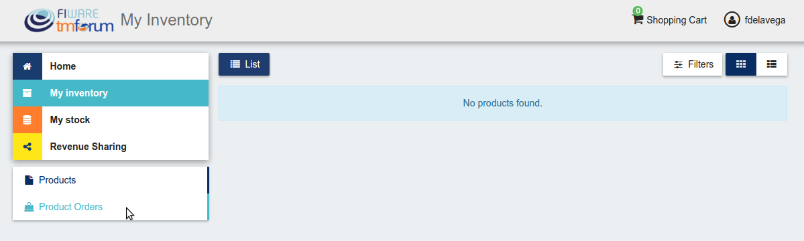
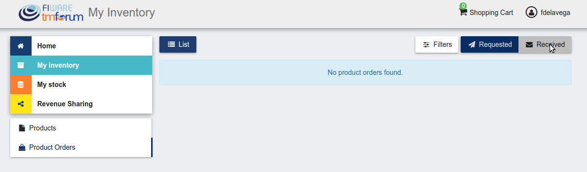
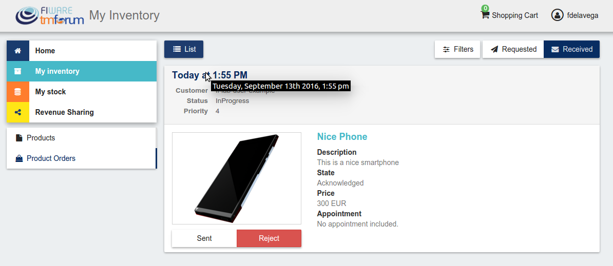
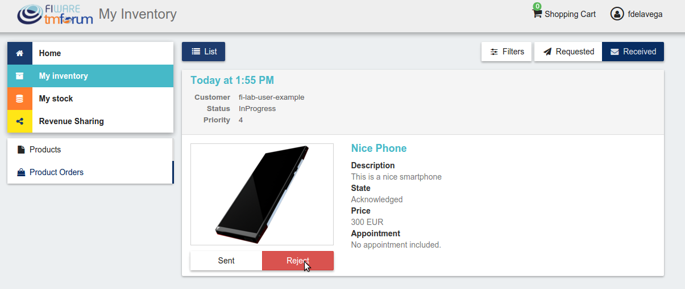
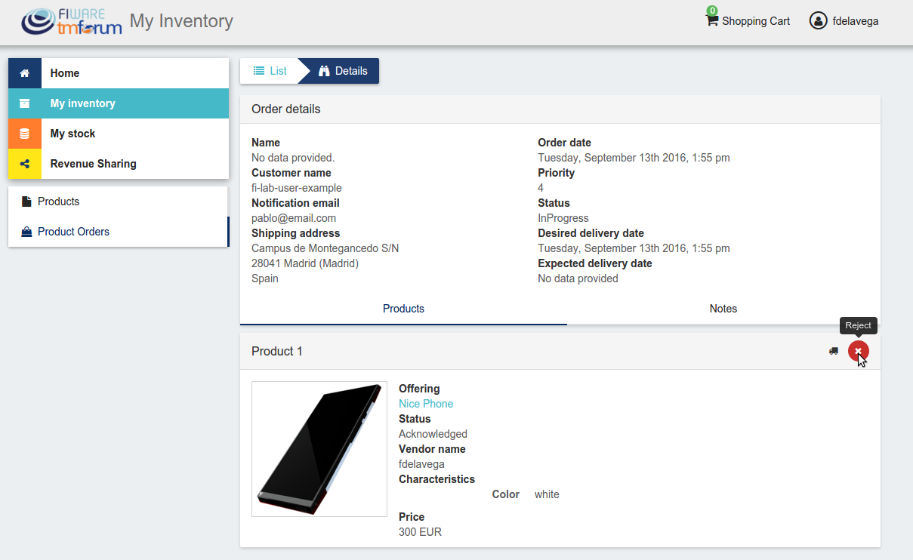
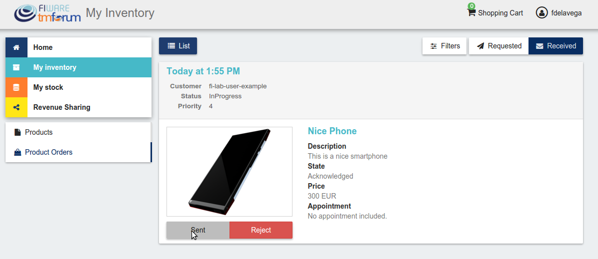
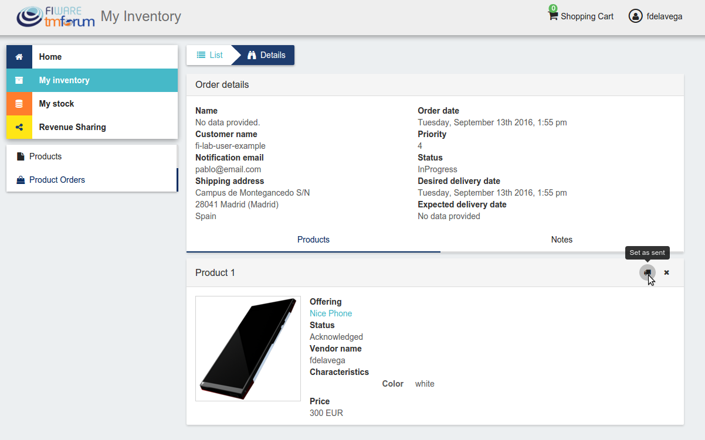
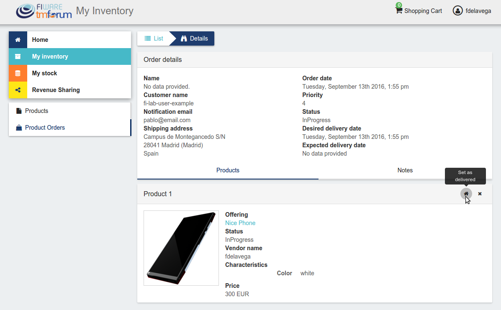

# Introduction to WireCloud

.fx: cover

@conwet

---
#Manage Received Orders

Sellers can manage the orders they have received in order to see the chosen characteristics, read customer notes, or process the order in case it has been acquired a physical product.

To view your received orders go to *My inventory* section, click on *Product orders*, and open the *Received* section.

---
# Manage Received Orders

---
# Manage Received Orders

---
# Manage Received Orders

---
# Manage Received Orders

You can view the details of a received order clicking on the order date

---
# Manage Received Orders

---
# Manage Received Orders

In the displayed view you can review the details of the order and the details of your products acquired by the customer, including the chosen characteristics.

Additionally, you can view the customer notes clicking on the *Notes* tab

---
# Manage Received Orders

---
# Manage Received Orders

You can also give a reply to customer notes including it in the text area and clicking on the send button

---
# Manage Received Orders

---
# Manage Received Orders

If the acquired product is not digital, the order needs to be processed manually by the seller, in the sense that the seller will have to send the acquired product to the customer. To deal with this situation, the order details view allows sellers to manually change the status of the order.

To reject a received order you have to click in the *Reject* button located in the search or in the details view of the order.

---
# Manage Received Orders

---
# Manage Received Orders

---
# Manage Received Orders

In case you accept the order and send the product to the customer, you have to put it as *inProgress* clicking on the *Sent* button

---
# Manage Received Orders

---
# Manage Received Orders

---
# Manage Received Orders

Finally, when the product arrives at its destination, you have to put it as *Completed* clicking on the *Delivered* button

---
# Manage Received Orders

---
# Manage Received Orders

---

.fx: back-cover

Thanks!

FIWARE                                FIWARE Lab
OPEN APIs FOR OPEN MINDS              Spark your imagination

         www.fiware.org               FIWARE Ops
twitter: @Fiware                      Easing your operations
