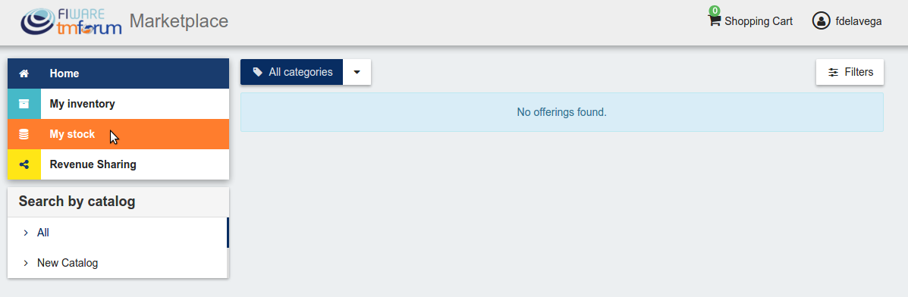

# Introduction to WireCloud

.fx: cover

@conwet

---
# Seller

If the user of the Business API Ecosystem has the *Seller* role, he will be able to monetize his products by creating, catalogs, product specifications and product offerings. All these objects are managed accessing *My Stock* section.

* Manage Catalogs
* Manage Product Specifications
* Manage Product Offerings
* Manage Revenue Sharing Models
* Manage Transactions
* Manage Received Orders

---
# Seller

---

.fx: back-cover

Thanks!

FIWARE                                FIWARE Lab
OPEN APIs FOR OPEN MINDS              Spark your imagination

         www.fiware.org               FIWARE Ops
twitter: @Fiware                      Easing your operations
