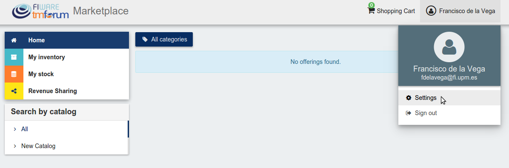
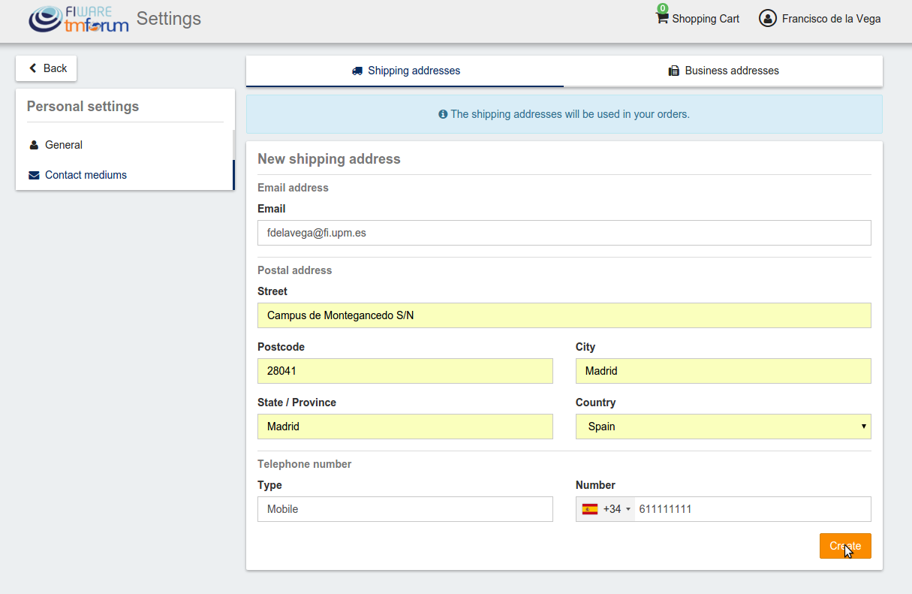
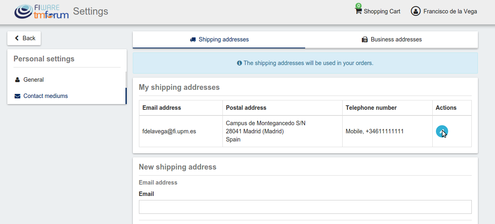
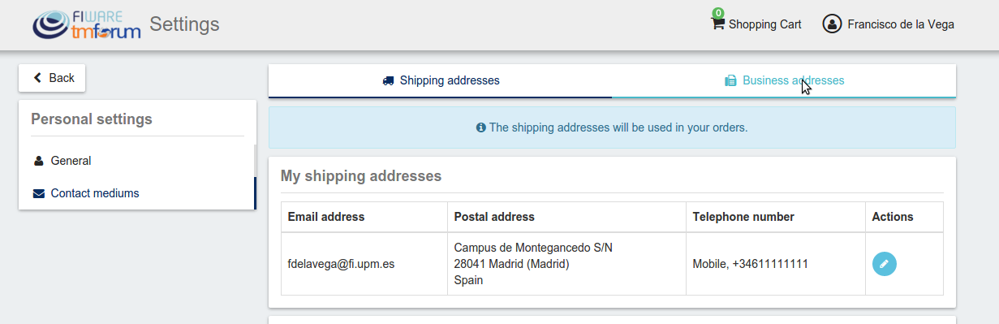
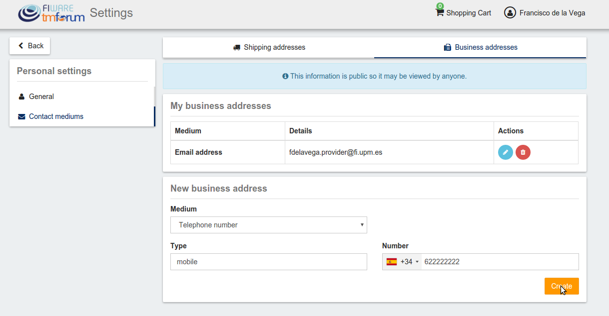
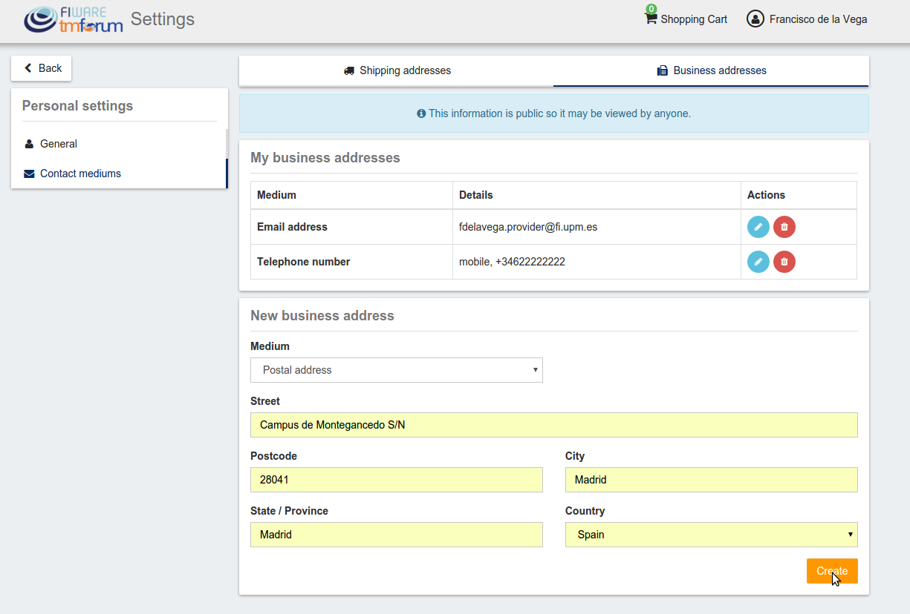
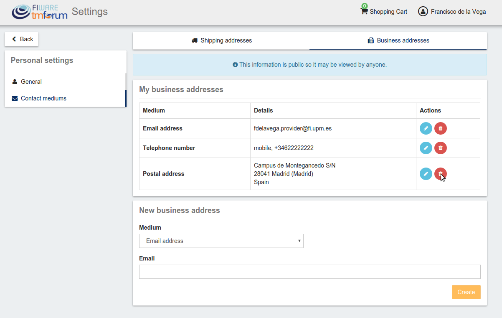

# Introduction to WireCloud

.fx: cover

@conwet

---
# Profile Configuration
All the users of the system can configure their profile, so they can configure their personal information as well as their billing addresses and contact mediums.

To configure the user profile, the first step is opening the user *Settings* located in the user menu.
 
   
In the displayed view, it can be seen that some information related to account is already included (*Username*, *Email*, *Access token*).
This information is the one provided by the IdM after the login process.
---
To create the profile, fill in the required information and click on *Update*
 
---
Once you have created your profile, you can include contact mediums by going to the *Contact mediums* section.
 
In the *Contact Medium* section, there are two different tabs. On the one hand, the *Shipping addresses* tab, where you can register the shipping addresses you will be able to use when creating order and purchasing products.
---
To create a shipping address, fill in the fields and click on *Create*

 
 
---
Once created, you can edit the address by clicking on the *Edit* button of the specific address, and changing the wanted fields.

 
   
 

---
On the other hand, if you have the *Seller* role you can create *Business Addresses*, which can be used by your customers in order to allow them to contact you.

 

In the *Business Addresses* tab you can create, different kind of contact mediums, including emails, phones, and addresses.
---
To create a contact medium, fill in the fields and click on *Create*

 
   
 

 

---
You can *Edit* or *Remove* the contact medium by clicking on the corresponding button

 